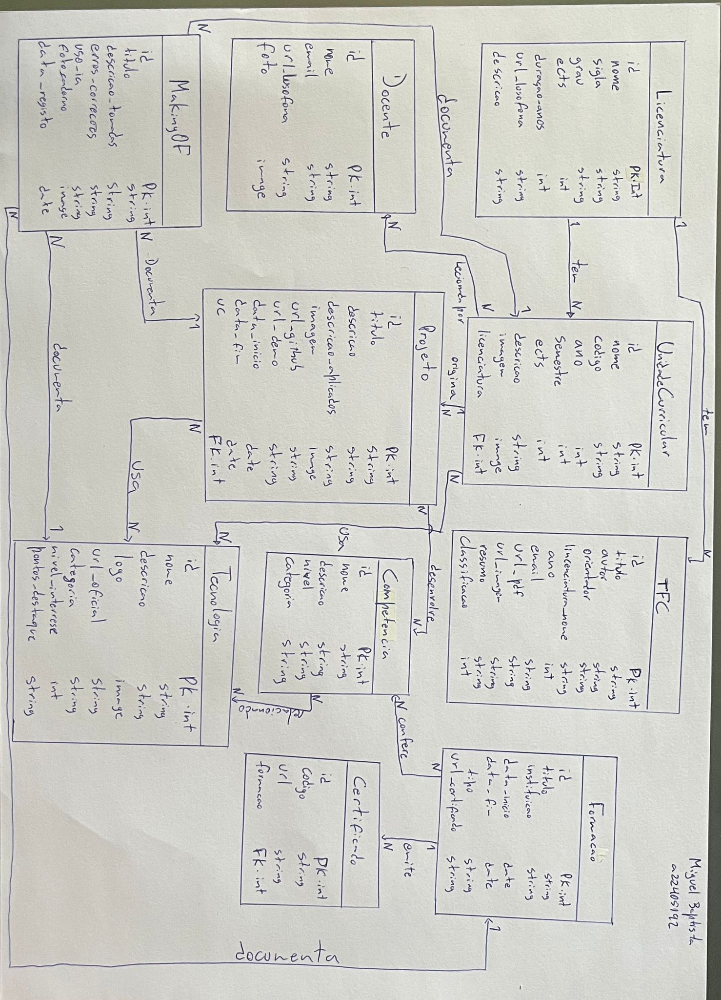

# Making Of — Portfolio Django
**Autor:** Miguel Baptista  
**Curso:** Licenciatura em Engenharia Informática — Universidade Lusófona  
**UC:** Programação Web  
**Data:** Abril 2026  

---

## Introdução

Este documento é o diário de bordo do processo de modelação e desenvolvimento do portfolio académico em Django. Regista todas as decisões tomadas, erros encontrados, correções aplicadas e justificações das escolhas de modelação. O objetivo é documentar não só o resultado final, mas o processo de pensamento que levou até ele.

O projeto consiste numa aplicação web Django que serve como portfolio académico e pessoal, reunindo informação sobre a licenciatura, unidades curriculares, projetos, tecnologias, competências e formações.

## Escolhas de Formato

**Formato Markdown:** Optei por documentar este Making Of em Markdown porque estou familiarizado com este formato através dos Worklogs semanais que realizo na disciplina de Laboratório de Manutenção de Software, lecionada pelo Professor Pedro Alves. Esta familiaridade permite-me escrever de forma mais fluida e estruturada.

**Formato do DER:** O DER foi desenhado no formato entidade-relação clássico (tabelas com atributos e linhas de relação) porque este foi o formato estudado e praticado na UC de Bases de Dados no semestre anterior. Tentei outras abordagens mais simplificadas mas o resultado ficava desorganizado e difícil de ler. O formato que conheço permite-me representar com mais clareza os atributos, tipos e cardinalidades de cada entidade.

---

## Diagrama Entidade-Relação (DER)

O DER foi desenhado à mão no caderno antes de iniciar a implementação. A fotografia encontra-se em `media/makingof/DER-portfolio.jpeg`.

---

## Decisões de Modelação por Entidade

### 1. Licenciatura
**Decisão 1 — Incluir `sigla`:** A sigla (LEI) é usada frequentemente em referências internas. Facilita pesquisas e filtragens no admin.  
**Decisão 2 — Incluir `url_lusofona`:** Permite ao visitante verificar a fonte oficial e aceder a informação atualizada.  
**Decisão 3 — Não incluir `coordenador`:** Não é relevante para um portfolio pessoal.

### 2. Unidade Curricular
**Decisão 1 — Incluir `codigo`:** Único e permite identificar rapidamente cada disciplina e associar projetos à UC correspondente.  
**Decisão 2 — Relação ManyToMany com Docente:** Uma UC pode ter vários docentes e um docente pode lecionar várias UCs.  
**Decisão 3 — Relação ManyToMany com Tecnologia:** Permite mostrar em que contexto cada tecnologia foi aprendida.

### 3. Docente
**Decisão 1 — Incluir `url_lusofona`:** O enunciado especifica explicitamente a ligação à página pessoal no site da Lusófona.  
**Decisão 2 — Incluir `foto`:** Campo opcional para não obrigar a ter foto de todos os docentes.

### 4. Projeto
**Decisão 1 — Incluir `url_github`:** O enunciado destaca que é muito importante para entrevistas de emprego.  
**Decisão 2 — Incluir `conceitos_aplicados`:** Mostra o que foi aprendido em cada projeto, o que um recrutador quer saber.  
**Decisão 3 — Incluir `data_inicio` e `data_fim`:** Permitem ordenar cronologicamente e mostrar a evolução ao longo do curso.  
**Decisão 4 — FK para UnidadeCurricular:** Contextualiza o projeto académico e mostra a progressão ao longo do curso.  
**Fonte dos dados:** Os projetos incluídos foram retirados do meu portfolio pessoal em https://miguel-baptista-plum.vercel.app/ — são projetos reais que desenvolvi ao longo do curso e que já estavam documentados no meu site pessoal.

### 5. Tecnologia
**Decisão 1 — Incluir `nivel_interesse` (1-5):** Permite mostrar as tecnologias favoritas de forma simples e visual.  
**Decisão 2 — Criar entidade `TipoTecnologia` (FK):** Na Ficha 8 substituí o campo `categoria` (CharField) por uma FK para `TipoTecnologia`. Isto permite agrupar tecnologias dinamicamente e adicionar novos tipos sem alterar o modelo.  
**Decisão 3 — Incluir `pontos_destaque`:** Permite destacar o que foi mais marcante na aprendizagem de cada tecnologia.

### 6. TFC
**Decisão 1 — `licenciatura_nome` como CharField em vez de FK:** O JSON real contém apenas texto sem correspondência com IDs da BD. Evita erros de integridade.  
**Decisão 2 — Incluir `classificacao` (1-5):** Permite destacar os TFCs de maior interesse conforme pedido no enunciado.

### 7. Competência
**Decisão 1 — Incluir `nivel` (Iniciante/Intermédio/Avançado):** Escala padrão em CVs, reconhecida no mercado de trabalho.  
**Decisão 2 — Relação ManyToMany com Tecnologia e Projeto:** Mostra evidência concreta de cada competência.

### 8. Formação
**Decisão 1 — Usar `data_inicio` e `data_fim`:** Permite ordenação cronológica automática e filtrar formações em curso.  
**Decisão 2 — Incluir `tipo`:** Diferencia entre Ensino Superior, Certificação Online, Experiência Profissional e Associação Estudantil.

### 9. Certificado (Entidade Extra)
**Justificação:** Separei o Certificado da Formação porque nem todas as formações geram um certificado com código verificável. Segue o princípio da normalização — evita campos nulos em muitas formações.  
**Decisão 1 — Separar de Formação:** Uma formação pode não ter certificado (ex: participação no NEDI).  
**Decisão 2 — FK com Formação:** Um certificado pertence a uma formação específica.

### 10. MakingOf 
**Decisão 1 — `entidade_relacionada` como CharField:** Simplifica o modelo em vez de criar FKs separadas para cada entidade.  
**Decisão 2 — Incluir `uso_ia`:** O enunciado especifica explicitamente que o uso de IA deve ser documentado.

---

## Ficha 7 — Views, Templates e Navegação

### Navegação entre Apps
**Decisão — Botão Portfolio no nav da Escola:** Adicionei um 4º link "Portfolio" no nav da app Escola (`escola/templates/escola/base.html`) que aponta para `/portfolio/projetos/`. Permite navegar diretamente da Escola para o Portfolio sem alterar o URL manualmente.

## Ficha 8 — Formulários CRUD e Página Sobre

### Formulários CRUD
**Decisão 1 — Usar `ModelForm` com `fields = '__all__'`:** O Django gera automaticamente todos os campos do modelo no formulário. Simples e eficiente para um portfolio pessoal onde não há necessidade de restringir campos.  
**Decisão 2 — Botões por cor:** Editar (azul), Apagar (vermelho), Novo (verde). Convenção visual intuitiva e comum em aplicações web.  
**O que gostei:** A simplicidade do Django Forms surpreendeu-me, com poucas linhas de código é possível criar formulários funcionais com validação automática.  
**O que não gostei:** O estilo padrão do `form.as_p` é muito básico e requer CSS adicional para ficar apresentável.

### Entidade TipoTecnologia (nova - Ficha 8)
**Justificação:** O enunciado da Ficha 8 pede para estruturar as tecnologias por tipos (Frontend, Backend, Base de Dados, Storage, Outros). Criei a entidade `TipoTecnologia` com uma relação FK para `Tecnologia`.  
**Decisão 1 — FK em vez de CharField:** Permite adicionar novos tipos sem alterar o código, e agrupa as tecnologias dinamicamente na página Sobre.  
**Decisão 2 — Cinco tipos:** Frontend, Backend, Base de Dados, Storage e Outros — cobre todas as tecnologias usadas e deixa espaço para crescer nas próximas fichas.  
**Commit:** `ab74b49` — "Tecnologia: adicionado modelo TipoTecnologia e FK tipo" — 24 Abril 2026

### Página Sobre
**Decisão 1 — Fotografias do papel:** Incluí as fotos do diagrama MVT e do mapa de navegação desenhados à mão, conforme pedido no enunciado.  
**Decisão 2 — Tecnologias agrupadas por tipo:** A página Sobre usa `prefetch_related('tecnologia_set')` para mostrar as tecnologias organizadas por tipo, sem consultas extra à base de dados.  
**Decisão 3 — django-markdownify:** Instalado para renderizar os campos `pontos_destaque` e `decisoes_tomadas` com formatação Markdown.

### Vídeo-tutorial
**Decisão 1 — Gravar demonstração completa:** Gravei um vídeo de 5 minutos a explicar todos os ficheiros envolvidos na criação de uma página com formulário (models.py, forms.py, urls.py, views.py, template) e a demonstração em funcionamento no browser.  
**Decisão 2 — Incorporar na página Sobre:** O vídeo está incorporado via iframe na secção "Arquitetura MVT" da página Sobre, conforme pedido no enunciado.  
**Link:** https://youtu.be/oDEnLL46uzY

## Ficha 9 — Autenticação e Artigos

### App Accounts — Autenticação por Senha
**Decisão 1 — App separada `accounts`:** Separei a autenticação numa app própria para manter o código organizado e reutilizável.  
**Decisão 2 — `UserCreationForm`:** Usei o formulário padrão do Django para o registo, aproveitando a validação automática de passwords.  
**Decisão 3 — Grupo `gestor-portfolio`:** Apenas utilizadores deste grupo veem os botões de editar/apagar/criar nas páginas CRUD. A verificação é feita na view (passando `is_gestor` no context) em vez do template, porque os templates Django não suportam chamadas de método com parâmetros.  
**Decisão 4 — `@login_required`:** Adicionado como segurança extra nas views CRUD para impedir acesso direto via URL.

### Autenticação por Link Mágico
**Decisão 1 — Modelo `MagicToken`:** Criei um modelo com UUID único, data de criação e flag `usado`, com validade de 15 minutos.  
**Decisão 2 — `EMAIL_BACKEND = console`:** Em desenvolvimento o email aparece no terminal em vez de ser enviado, permitindo testar sem configurar SMTP.  
**Decisão 3 — Integração na página de login:** O link mágico aparece como alternativa na página de login principal.

### App Artigos
**Decisão 1 — Modelo `Artigo` com FK para `User`:** O autor fica associado ao utilizador Django, permitindo que cada autor só edite os seus próprios artigos.  
**Decisão 2 — Likes por IP:** Usei o IP do utilizador como identificador para likes, evitando autenticação obrigatória para gostar de um artigo.  
**Decisão 3 — Comentários só para autenticados:** Segue o requisito do enunciado — qualquer pessoa vê os artigos, mas só utilizadores com conta podem comentar.  
**Decisão 4 — Grupo `autores`:** Utilizadores registados são automaticamente adicionados ao grupo autores, com permissão para criar e editar artigos.

## Ficha 10 — CI/CD e Deploy em Produção

### Arquitetura Cloud
**Decisão 1 — PostgreSQL no Neon:** Migrei a base de dados de SQLite local para PostgreSQL na cloud (Neon). Permite que a aplicação funcione em qualquer ambiente sem depender de ficheiros locais.  
**Decisão 2 — Ficheiros media no Cloudinary:** Os ficheiros de media (imagens) passaram a ser guardados no Cloudinary. Evita perda de dados quando o container reinicia.  
**Decisão 3 — WhiteNoise para ficheiros estáticos:** Configurado para servir CSS e JS diretamente pelo Django em produção, sem necessidade de servidor web adicional para estáticos.

### Ambiente Virtual e Dependências
**Decisão 1 — `venv` isolado:** Criei um ambiente virtual para isolar as dependências do projeto do sistema operativo.  
**Decisão 2 — `requirements.txt` atualizado:** Adicionados `psycopg2-binary`, `dj-database-url`, `django-environ`, `cloudinary`, `django-cloudinary-storage` e `gunicorn`.

### Deploy com Docker e CI/CD
**Decisão 1 — Repositório na organização pw-2425-alunos:** Criei o repositório `miguelbaptista22405192` baseado no template `django-template` que inclui o pipeline CI/CD.  
**Decisão 2 — GitHub Secrets:** As variáveis sensíveis (DATABASE_URL, CLOUDINARY_*, SECRET_KEY) são guardadas como Secrets no GitHub e injetadas no container em produção.  
**O que aprendi:** Cada push para o repositório dispara automaticamente o build Docker e o deploy no servidor do DEISI — é o conceito de CI/CD na prática.

### Aplicação Live
A aplicação está disponível em: https://miguelbaptista22405192.pw.deisi.ulusofona.pt/

---

## Erros Encontrados e Correções

| # | Erro | Correção |
|---|------|----------|
| 1 | Modelo TFC com campos que não existiam no JSON real | Análise do JSON e recriação do modelo com campos corretos |
| 2 | Modelos não guardados corretamente após prompts iniciais | Recriação de todos os modelos conforme o DER |
| 3 | Campo `decisoes_tomadas` sem `blank=True` impediu migração | Adicionado `default=''` temporariamente |
| 4 | Nomes dos docentes sem acentos por encoding no Windows | Script corrigido com `io.TextIOWrapper` e `encoding='utf-8'` |
| 5 | Push feito para o repositório errado | Remote corrigido e push para repositório correto |
| 6 | Foto do DER não aparecia na página Sobre | Caminho corrigido para `/media/makingof/DER-_portfolio.jpeg` |
| 7 | Tecnologias Django, Python e Git sem tipo associado | Associadas via shell ao tipo correto após criação do TipoTecnologia |
| 8 | Templates Django não suportam `.filter().exists()` em `` | Verificação movida para a view, passando `is_gestor` e `is_autor` no context |
| 9 | Utilizadores `gestor` e `pw25profs` com `is_active=False` | Corrigido via shell com `update(is_active=True)` |
| 10 | Repositório com letras maiúsculas bloqueou o build Docker | Nome do repositório alterado para lowercase |
| 11 | Django==6.0.5 incompatível com Python 3.11 do Docker | Downgrade para Django==5.2.1 |
| 12 | collectstatic falhava no build por falta de variáveis | Adicionados valores default no settings.py |
| 13 | Gunicorn apontava para `project.wsgi` em vez de `portfolio_project.wsgi` | Corrigido o CMD no Dockerfile |
---

## Uso de Inteligência Artificial

Utilizei o **Claude** (Anthropic) como ferramenta de apoio. O uso foi transparente e controlado:

**Como foi utilizado:** Geração de scripts de carregamento de dados, sugestão de atributos para cada entidade, resolução de erros técnicos e estruturação do DER.

**O que foi decidido por mim:** Quais atributos incluir, a escolha da entidade extra (Certificado), os dados reais inseridos, o DER desenhado à mão e todas as decisões de modelação justificadas neste documento.

---

*Miguel Baptista — Abril 2026*
